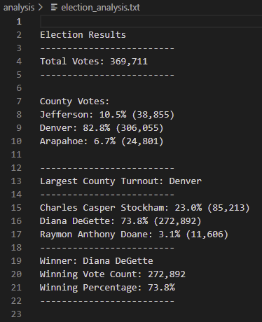

# Election Analysis 
## Overview of Election Audit
An election analysis was performed for the Colorado Board of Elections to certify a U.S. Congressional race. Python and Visual Studio Code were used to write algorithms that confirmed and analyzed the election results. Our Python script shows the following information:
- Total number of votes casted
- List of counties, how many votes received, and percentage of votes
- List of candidates who received votes, how many votes received, and percentage of votes
- Winner of the election based on popular vote
## Election-Audit Results
The following are the results for the Election-Audit:
- Total Votes: 369,711
- Total number of Votes & Percentages of Votes per County:

  - Jefferson received 10.5% of the votes, equal to 38,855 votes.
  - Denver received 82.8% of the votes, equal to 306,055 votes.
  - Arapahoe received 6.7% of the votes, equal to 24,801 votes.

The county with the largest number of votes was Denver.

The following are the candidates:

  - Charles Casper Stockham received 23.0% of the votes, equal to 85,213 votes.
  - Diana DeGette received 73.8% of the votes, equal to 272,892 votes.
  - Raymon Anthony Doane received 3.1% of the votes, equal to 11,606 votes.

**Diana DeGette won the election by popular vote with 272,892 votes equalling to 73.8%**

In our Python script, we created a txt file to write our results. 

We achieved the Largest County Turnout result with the following code:

`` 
    #6a: Write a for loop to get the county from the county dictionary
    for county_name in county_votes:
        # 6b: Retrieve the county vote count.
        votes_county = county_votes.get(county_name)
        # 6c: Calculate the percentage of votes for the county.
        county_percentage = float(votes_county) / float(total_votes) * 100

         # 6d: Print the county results to the terminal.
        county_results = (
            f'{county_name}: {county_percentage:.1f}% ({votes_county:,})\n')
         # 6e: Save the county votes to a text file.
        print(county_results)
        #  Save the candidate results to our text file.
        txt_file.write(county_results)
         # 6f: Write an if statement to determine the winning county and get its vote count.
        if (votes_county > largest_votes): 
            largest_votes = votes_county
            largest_county = county_name
``

## Election-Audit Summary
Using this python script allowed us to run a large set of data with algorithms to achieve all the results we were aiming for. This script can also be used for other elections. For example, in a presidential race you can determine votes per state. You can also include what party they are running for. Some modifications, you'll need to make are:
- Changing the file to load and file to save path
- Change county votes for state votes
- Create a "Candidate_Party" Dictionary
- Add "Candidate_Party" in your print f loop
